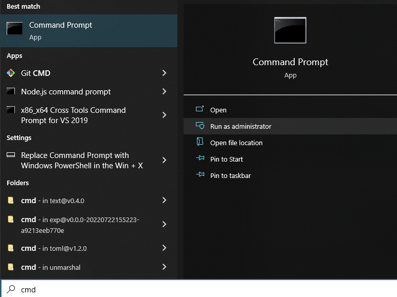
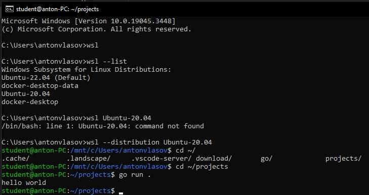
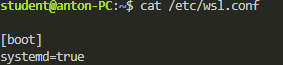
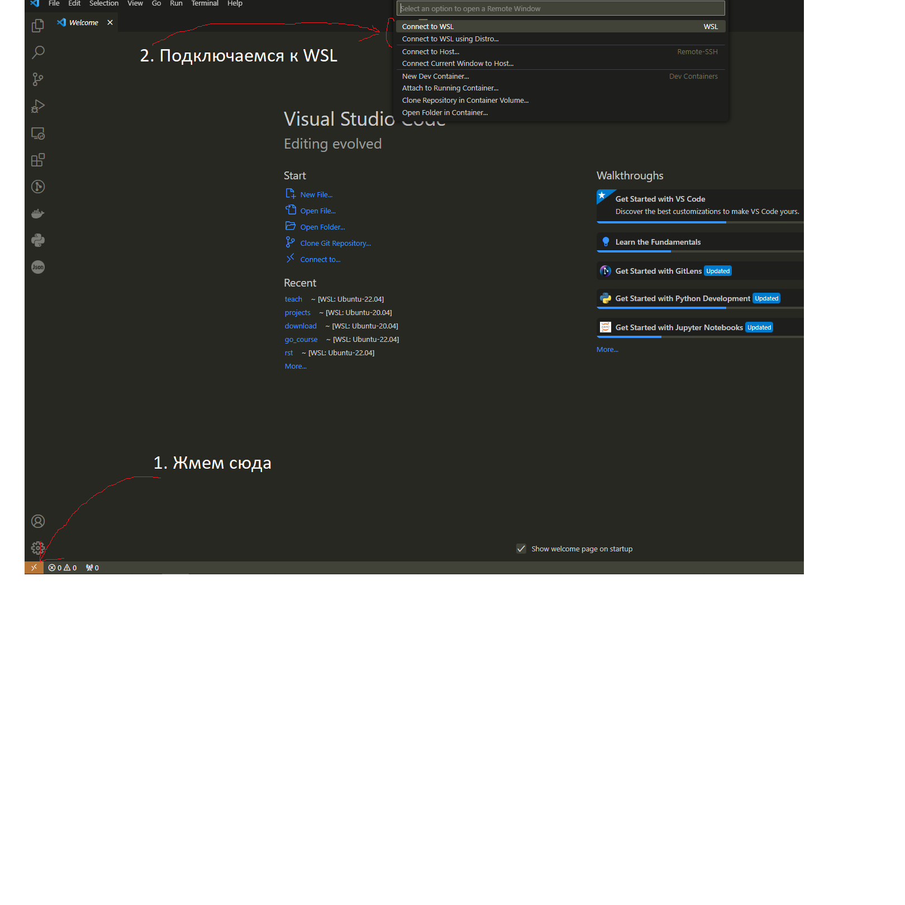
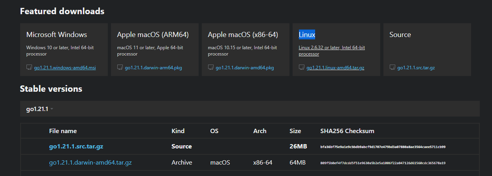
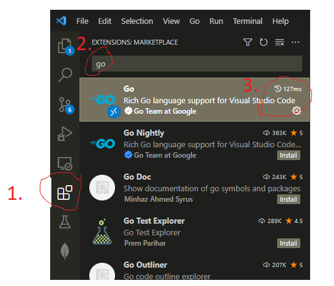
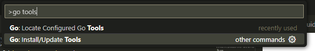

# Гайд по установке окружения

## Предисловие
Для прохождения курса каждому понадобится поставить следующий список вещей:

- go
- IDE (vscode)
- go tools
- git
- Docker

Мы настоятельно рекомендуем ставить все это на линукс, для тех у кого Windows мы подготовили образ виртуальной машины, где все уже поставлено. Если единственной ОС является не Windows, ставить данные инструменты нужно так как мы описываем.

Мы постарались сделать описание установки максимально понятным и унифицированным, но у кого-то могут возникнуть индивидуальные проблемы. Сейчас самый важный навык для программиста - уметь гуглить, поэтому если возникают проблемы, попытайтесь найти их решение через google. Быстрее всего найти ответ можно если пользоваться именно google, делать запросы на английском языке и смотреть результаты с сайта stackoverflow. Если вы не смогли решить возникшую проблему самостоятельно, пишите в общий чат, попробуем помочь.

## Windows
#### Установка WSL
Самый сложный этап, так как на винде уже предустановлена WSL, но, зачастую, неправильной версии. Мы собрали для вас ресурсы где описывается то как можно правильно поставить WSL2. Также важно обратить внимание на то что на сегодняшний день WSL2 и VirtualBox не могут работать одновременно. Однако между ними можно переключаться, так что доступ к VirtualBox не будет потерян.

1. В поиск пишем cmd, запускаем консоль от имени администратора 
2. Выполняем команду ```wsl --version```. Если команда выполнится с ошибкой или мы увидим что версия wsl ниже 0.67.6, значит нам требуется установить новую WSL. Проще всего это сделать через microsoft store по данной ссылке https://aka.ms/wslstorepage.
3. Скачиваем подготовленный дистрибутив
4. Устанавливаем его командой 
    ```wsl.exe --import Ubuntu-20.04-ninja <InstallLocation> <FileName>```
    InstallLocation - место где будут храниться внутренние файлы WSL, можно указать c:\\ubuntu-20.04-ninja
    FileName - путь к скачанному tar из п. 3
5. Проверяем что ubuntu установилась - пишем 
    ```wsl --list```
    Мы должны увидеть наше название - ubuntu-20.04-ninja
6. Запускаем нашу убунту.
    ```wsl --distribution Ubuntu-20.04-ninja```
7. Проверяем что go работает:
    ```
    cd ~/projects
    go run .
    ```
    Должны получить такой же результат
    
8. Проверяем что у нас включен systemd:
    ```
    sudo cat /etc/wsl.conf
    ```
    Должны увидеть systemd=true
    

Установка Ubuntu через WSL завершена, нужно закрыть терминал

#### Установка и подключение vscode
1. Устанавливаем и открываем vscode https://code.visualstudio.com/download
2. Подключаемся к WSL. Можно выбрать вариант connect to WSL если у вас наша убунта является дефолтным дистрибутивом в WSL (при ```wsl --list``` напротив названия стоит (default)). Иначе нужно выбрать Connect to WSL using Distro и выбрать Ubuntu-20.04-ninja.
   
3. Заходим в нашу папку проекта. Слева сверху нажимаем 
    ```File->Open Folder->/home/student/projects```
4. Открываем консоль сочетанием клавиш ``` ctrl+` ```
5. Проверяем что программа на go работает - пишем в консоли внутри vscode ```go run .``` Мы должны получить тот же результат что и при тесте установки WSL.
6. Проводим настройку VSCode. В полученном дистрибутиве уже может быть установлено расширение на go, не нужно удивляться если это так, просто пропускаем шаг настройки. Настройка описана в секции [Настройка VSCode](#настройка-vscode)


#### Заключение
Теперь у вас есть IDE и ОС со всем что нам понадобится во время курса. На занятиях мы покажем как работать с IDE, но можете уже сейчас попробовать написать некоторый код и позапускать его. Мы рекомендуем вам начать смотреть [a tour of go](https://go.dev/tour/welcome/1) - минималистичный гайд от создателей языка о том как им пользоваться. Первые занятия мы будем смотреть и обсуждать некоторые моменты более глубоко, рекомендуем изучить материал заранее самостоятельно, потом будет проще его обсуждать.

## Linux
1. Устанавливаем go 1.21 согласно инструкции с оф. сайта https://go.dev/doc/install. Выбираем архив с go в зависимости от своей архитектуры, скорее всего вам подойдет вариант Linux из Featured Downloads.
2. Устанавливаем Docker и добавляем нашего юзера в группу docker 
    ```
    https://docs.docker.com/engine/install/ubuntu/#install-using-the-repository
    https://docs.docker.com/engine/install/linux-postinstall/#manage-docker-as-a-non-root-user
    ```
3. Устанавливаем git https://git-scm.com/download/linux
4. Устанавливаем vscode https://code.visualstudio.com/download и настраиваем. [Настройка VSCode](#настройка-vscode)
5. Читаем [заключение](#заключение)

## Mac
Следуем инструкции для Linux, скачивая файлы выбираем версии для вашей архитектуры.

## Настройка VSCode
1. Добавляем extension для go 
2. Устанавливаем инструменты для упрощения работы с кодом. Нажимаем сочетание клавиш ```ctrl+shift+P```, пишем в открывшуюся строку go tools, выбираем стрелочками или мышкой Go: Install/Update tools и жмем Enter.

