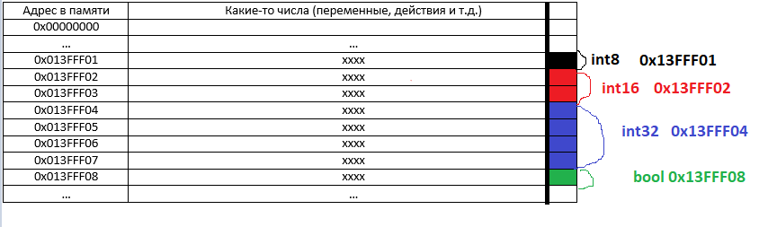

# Занятие 1
### Основы go
Golang - компиллируемый язык со строгой статической типизацией.

В песочнице: импорты, принт (им можно дебажить), определение переменных, базовые типы, функции.

### Основы памяти

Немного про память. Память программы представляет собой набор ячеек одинакового размера, нумерующихся с нуля. Кажная ячейка - один байт. Объекты которые мы будем рассматривать распологаются в памяти непрерывно и занимают одну или несколько ячеек. Соответственно, они характеризуются адресом памяти где они начинаются и размером.



Разные части памяти предназначенны для разных действий. Два основных раздела памяти которые нас интересуют это стек и куча. 

Начнем с описания стека. В него добавляются данные только наверх и удаляются данные только сверху. Данные класться в стек во начале исполнения программы: точка входа, локальные переменные, последующие вызовы функции и их возвращаемые переменные.


#### Стек

Стек на примере программы stack_basic 

```
package main

import "fmt"

//go:noinline
func max(x int, y int) int {
	if x>y{
		return x
	}

	return y
}

func main() {
	var (
		a   int = 42
		b   int = 13
		res int
	)

	res = max(a, b)

	fmt.Println(res)
}
```


#### Область видимости (scope)

Подобно тому как локальные переменные функции удаляются из стека после завершения функции, переменные удаляются из стека всегда при выходе из области видимости.

```

func a(){
    a:=0

    for i:=0;i<10;i++{
        b:= i*2
        a+=b
    }

    // b не видно

    {
        g :=10
        c:= 44
        
        a = g*3 - c*2
    }

    // g и c не видно
}
```

#### Поинтеры

Поинтеры на примере программы pointers

```
package main

import "fmt"

//go:noinline
func max(x *int, y *int, res *int) {
	var (
		xDeref int = *x
		yDeref int = *y
	)

	if xDeref > yDeref {
		*res = xDeref
		return
	}

	*res = yDeref
}

func main() {
	var (
		a   int = 42
		b   int = 13
		res int
	)

	var (
		aPtr   *int = &a
		bPtr   *int = &b
		resPtr *int = &res
	)

	max(aPtr, bPtr, resPtr)

	fmt.Println(res)
}
```


Поинтеры нужны чтобы не копировать данные/вносить изменения в переданные данные.

Указатели хранят данные об адресе переменной, указатели хранятся на стеке. Размер указателя зависит от возможного адресуемого размера памяти. В 32bit системах это 4 байта (размер памяти 4 Гб), в 64 bit - 8 байт (размер памяти 16 млн Тб).

Обращения к объекту по указателю вызываеют оверхед (накладные расходы) процессора так как он должен сходить в 2 места вместо одного, зачастую происходит промах кеша.


#### Структуры

```

type Point3d struct{
    x int16
    y int16
    z int16
}

```


#### Куча

Куча - часть памяти, где объекты могут записываться и удаляться в произвольном порядке. Аллокатор находит свободное место куда можно поместить объект в момент его создания. В go за объектами из кучи следит сборщик мусора. Он переодически проверяет, нужен ли кому-то еще каждый из объектов и освобождает память если объект уже не нужен. Освобожденная память может быть использована снова.

Найти свободное место в хипе занимает время, аллокация это дорого. Сокращение числа аллокаций - одна из основных оптимизаций производительности. Сбор мусора тоже отнимает время. Однако хип упрощает работу с памятью для программиста. Использование сборщика мусора также проще чем ручная очистка памяти.


Основные случаи когда задействуется куча:
1. Время жизни объекта превышает время жизни скоупа где он определяется
2. В момент определения объекта неизвестен его размер/размер может меняться
3. Объект слишком большой для стека
   

Пример для п1. в heap_escape_struct

```
package main

type LargeObject struct {
	a int
	b int
	c int
	g int
}

//go:noinline
func newLargeObject(a, b, c, g int) *LargeObject {
	res := &LargeObject{
		a: a,
		b: b,
		c: c,
		g: g,
	}

	return res
}

func main() {
	a := 1
	b := 1
	c := 2
	g := 46

	obj := newLargeObject(a, b, c, g)

	_ = obj
}
```

```
./main.go:11:6: cannot inline newLargeObject: marked go:noinline
./main.go:22:6: cannot inline main: function too complex: cost 90 exceeds budget 80
./main.go:12:9: &LargeObject{...} escapes to heap:
./main.go:12:9:   flow: res = &{storage for &LargeObject{...}}:
./main.go:12:9:     from &LargeObject{...} (spill) at ./main.go:12:9
./main.go:12:9:     from res := &LargeObject{...} (assign) at ./main.go:12:6
./main.go:12:9:   flow: ~r0 = res:
./main.go:12:9:     from return res (return) at ./main.go:19:2
./main.go:12:9: &LargeObject{...} escapes to heap
```
