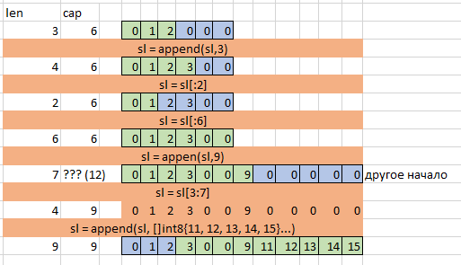

# Занятие 2

<!-- ### Вопросы по дз
Обсуждаем 10 мин общие вопроыс из тг по установке среды, вопросы по туру go. Обсуждаем 

### О слайсах и мапах

#### Слайсы и память (подсветим некоторые моменты)

Слайс - один из объектов который, как правило, помещается в стек. Это происходит если на этапе компилляции неизвестен размер слайса.

```
Пример из slice_example
``` -->
Как может утекать память, как работают слайсы. Насколько растет слайс - Undocumented feature.

```
Пример из slice_cut
```



#### Кратко про мапы

Говорить особо ничего, map - одна из основных структур в программировании. Не знаешь что делать - возьми хешмап.

Существует такая вещь как пустая структура, она не занимает памяти в go. Множества в go принято делать через мапу со значениями в виде пустых структур

```
numbers := []int{0,1,2,0,4,6}
uniqueNumbers := make(map[string]struct{},len(numbers))
for _,v:=range numbers{
    uniqueNumbers[v] = struct{}{}
}

fmt.Println(len(uniqueNumbers)) // 5
_, okZero := uniqueNumbers[0]
fmt.Println(okZero) // true
_, okTen := uniqueNumbers[10]
fmt.Println(okTen) // false
```


#### Передача по значению
Такие типы как map и slice сами по себе маленькие, они лишь указывают на внутреннее хранилище самих данных. В функции их обычно передают не по указателю, даже если требуется внести изменения в элементы. Исключение - функция, которой необходимо изменить размер слайса (почему - упражнение на дом)


### Методы и интерфейсы

Для удобства у структуры можно определить методы. Тема из ООП. Методы могут быть на структуру или на поинтер на структуру, в зависимости от этого данные структуры копируются или не копируются. Под капотом ресивер метода по сути передается как первый аргумент метода.

### Что такое ООП
Классы
Объекты
Objects are instances of a class created with specifically defined data. Objects can correspond to real-world objects or an abstract entity. When class is defined initially, the description is the only object that is defined.
Методы
Аттрибуты
Энкапсуляция
Абстракция
Наследование
Полиморфизм -> дак тайпинг


Duck typing: If it walks like a duck and it quacks like a duck, then it must be a duck

### Интерфейсы в go

Интерфейс описывает любой объект с заданным набором методов. Структуры могут реализовать интерфейс неявно: если есть метод с тем же названием и сигнатурой - он реализует метод интерфейса. Если структура реализует интерфейс с поинтер ресивером, саму структуру нельзя использовать где требуется этот интерфейс, требуется использовать указатель на нее.

Интерфейс по сути представляет собой структуру с двумя полями: указатель на тип данных и указатель на данные. Это хорошо описано в a tour of go, не будем сейчас это рассматривать.


### Три аспекта разработки кода
Интерфейсы тупят

#### Git

С git все очень просто.
Git это система версионирования которая делает снепшоты файлов в определенный момент. Каждый следующий снепшот не сохраняет все данные, а только разницу с предыдущим. Это называется коммит.
Все коммиты распологаются в ветках, у проекта есть одна или несколько основных веток. Будем рассматривать сейчас проект с одной основной веткой master.
Когда несколько человек работают над одним проектом, трудно всем сразу вносить изменения в мастера. Поэтому можно отделить свою ветку от основной и вести разработку там. В это время мастер может меняться, но это не затригвает работу в отдельной ветке. В какой-то момент работа в отдельной ветке достигает некоторого логического завершения и ее необходимо слить с основной веткой. Это называется мерж. 
Большая часть мержа происходит автоматически, но если за время между отделением ветки от мастера и ее слиянием в одном и том же месте произошли изменения и в ветке, и в мастере, происходит мерж конфликт. При мерж конфликте необходимо руками указать финальную версию проблемных файлов и завершить мерж. Это удобно делать в IDE.

В Git, как правило, есть удаленный сервер куда пишут все участники проекта, каждый может качать оттуда и писать туда. В общем состояние просто синхронизируется между сервером и клиентом (участником проекта) при определенных командах.

Нельзя просто всем писать в мастер - будет хаос. Поэтому мерж делается на стороне сервера обычно через UI через Pull Request. Как правило, существуют политики на PR: должны пройти тесты; определенное количество человек должны сделать ревью кода и поставить аппрув; должен отработать линтер.

Часть файлов, лежащих в проекте git, не требуется версионировать - готовые сборки, конфиги IDE и тп. Файлы можно игнорировать через .gitignore

В Git главное понимать сценарии работы и что происходит. Как именно это сделать - легко гуглится, лучший источник - stackoverflow. Помимо основных описанных выше сценариев в git много других возможностей: удаление прошлого коммита; создание и переход в новую ветку одной командой; временное сохранение изменений без коммита; перенос части изменений; выкачивание только части репозитория и многое другое. Представьте что вы хотите сделать с git и напишите это в гугле - вы получите ответ как.

Примерный процесс работы с git на псевдокоде

```
git config ... - сконфигурировать свою почту и имя
git clone ... - скачать репо
git checkout -b user/branchname - создать ветку и переключиться на нее
... вносятся изменения в файлы проекта
git add ... - выбрать файлы, которые будут добавлены в стейдж (файлы в стейдже будут сохранены в коммит)
git commit -m "commit name" - сделать коммит из застейдженных файлов
git pull origin master - скачать актуальную версию мастера с сервера и смерджить ее со своей. Тут могут появиться конфликты - их надо разрешить.
git push origin HEAD - запушить свою ветку на сервер
... в UI сервера делается PR, при необходимости внести изменния они добавляются также через push и потом PR завершается.
```

https://education.github.com/git-cheat-sheet-education.pdf